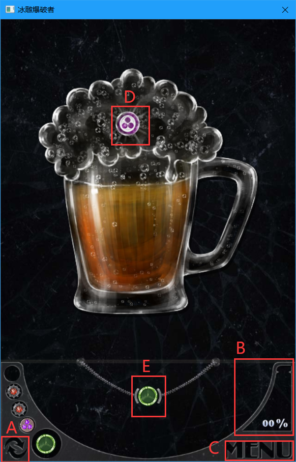

# AmazingBreaker
早期dx9作品，原游戏安卓 amazing breaker

### 碎碎念

bin中附带了一个Binary，但是因为使用的sdk过于久远，在某些新系统中会出现驱动不兼容导致游戏crash的情况由于使用了过气Dx9图形库以及D3d9xmath(自从巨硬使用D3DXmath后，这玩意已经从SDK中移除了)，所以编译代码需要使用老版的dx SDK，请自行下载
bin中附带了一个Binary，但是因为使用的sdk过于久远，在某些新系统中会出现驱动不兼容导致游戏crash的情况**由于使用了过气Dx9图形库以及D3d9xmath(自从巨硬使用D3DXmath后，这玩意已经从SDK中移除了)**，所以编译代码需要使用老版的dx SDK，请自行下载

### 操作方式

纯鼠标的操作方式，进入游戏后拖动子弹发射，一共有4种弹丸
- 普通弹，碰到冰面或速度降低到0即会爆炸 

- 三分弹，碰到冰面或速度降低到0即会爆炸，期间可以单击一根鼠标，射出三个镶嵌炸弹，子炸弹碰到冰面后会镶嵌在冰面上 

- 镶嵌弹，速度降低到0即会爆炸，可以跨越冰面，单击鼠标可以落下一颗镶嵌炸弹 

- 普通弹，碰到冰面或以过大角度碰到边框会发生爆炸，飞行过程中可以按住鼠标左键左右拖动来改变飞行轨迹 

其中，产生的镶嵌弹如果可以被连续引爆，会生成一根连线 

### 游戏界面

- A:  交换槽底和当前的子弹 
- B: 爆破的进度，通过关卡需要达到90%，完美通关需要100% 
- C: 打开菜单，游戏暂停
- D: 子弹道具，被爆炸击中会增加子弹
- E: 当前子弹，拖动可以发射，拖出发射台取消发射 
